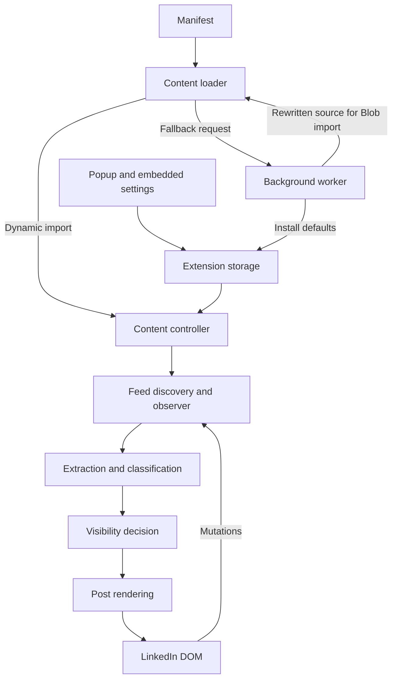
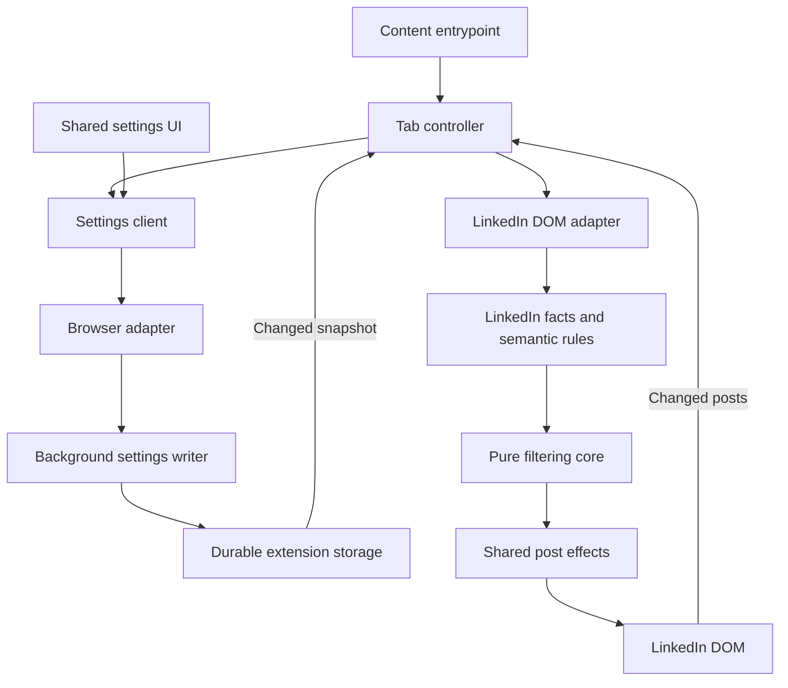

# Modular extension architecture

Status: accepted implementation contract for [#19](https://github.com/yasingedik/cleanedin/issues/19), subject to PR review.
Release tracker: [#18](https://github.com/yasingedik/cleanedin/issues/18).
Support, behavior, and completion contract: [modular release scope](modular-release.md).

This document describes the current implementation and the target for the next
modular release. Target modules are planned, not already implemented. Start with
folders in one TypeScript repository; separate packages require an actual reuse
or independent-versioning need.

## Verified baseline

The implementation starts at
[`99ce53374de3c32702b8f45ded220fe3925e159d`](https://github.com/yasingedik/cleanedin/commit/99ce53374de3c32702b8f45ded220fe3925e159d),
the `main` head inspected on September 9, 2026. The extension and manifest are
version **0.1.11**, and the settings schema is **6**. Node **24** is the build/CI
baseline. The earlier review used `4498d2d`; only `package.json` and
`package-lock.json` changed between those revisions, including Vitest moving to
5.0.0. New baseline test results belong to [#20](https://github.com/yasingedik/cleanedin/issues/20);
the previous review's passing CI is not proof that this newer revision passes.

Source anchors: [manifest](../manifest.json), [package](../package.json),
[settings schema](../src/shared/schema.ts), and [CI](../.github/workflows/ci.yml).
Baseline source paths below may move as later issues are completed.

## Current execution model

The manifest injects a loader on `https://www.linkedin.com/*` at
`document_idle`. Each tab owns its filtering state. A toolbar popup and an
extension-owned iframe in the feed share popup code but are separate documents.
The background handles installation defaults and a fallback source-delivery
message. Filtering reads LinkedIn's rendered DOM; it is not a network blocker.

1. [The loader](../src/content/loader.ts) tries a dynamic import of packaged
   `content.js`. On failure it requests `getContentBundle`; the background
   fetches packaged source and rewrites chunk imports for a Blob import. The
   retry delays are 0, 250, and 1,000 milliseconds.
2. [The controller](../src/content/index.ts) reads sync/local preferences,
   watches routes, and activates feed discovery. Current filtering accepts
   `/` and paths starting with `/feed`; the panel requires exact `/feed/`.
3. [Feed discovery](../src/content/feed-root.ts) separates a post's outer
   `renderRoot` from its inner `featureRoot`. Structural fallbacks help when
   selectors fail. [The observer](../src/content/observer.ts) batches added
   elements at a default 80 milliseconds and watches feed-root replacement.
4. [Extraction](../src/content/extractor.ts) and [identity](../src/content/post-id.ts)
   obtain names, text, age, relationship, profile type, links, and an identity.
   [Classification](../src/content/classifier.ts) applies ordered rules, which
   still query the DOM through `PostFeatures`.
5. [The decision engine](../src/content/decision.ts) evaluates enabled filters
   and returns the first hide explanation. [Rendering](../src/content/render.ts)
   changes visibility and adds a badge with a temporary reveal action.
6. [Popup controls](../src/popup/index.ts) write preferences through
   [storage wrappers](../src/shared/storage.ts). Change notifications reload
   settings and reevaluate posts. Route resets dispose observers, timers,
   panel/badge state, and temporary reveals.

The main structural problems are runtime source loading, DOM elements in shared
facts, selectors inside semantic rules, direct Chrome APIs outside a platform
boundary, and post effects mixed with panel layout. The route watcher patches
history from an isolated content-script world, so page-world navigation needs a
real reproduction and replacement in #28. Added-element observation also needs
explicit invalidation for text/attribute changes in #29.

## Target runtime

Use WXT for builds and entrypoint wiring, with explicit MV3 browser targets.
Inject a directly loadable content bundle. Source sharing does not require
runtime chunk sharing between the popup, background, and content contexts.

The arrows below show runtime calls and data flow, not an inheritance hierarchy
or separate services.

The background is an event handler, not the owner of the feed. Each tab caches
settings and post facts, so ordinary filtering continues while the background is
suspended. Settings messages carry small validated patches; posts do not make
background round trips.

### Module ownership and allowed dependencies

Allowed dependencies are public interfaces; a module must not reach into another
module's private files. `platform/contracts` contains generic storage/messaging
ports, not browser globals. Runtime dependencies and type-only imports follow
the same architectural direction.

| Module | Owns | Allowed internal dependencies | Forbidden |
| --- | --- | --- | --- |
| `core/` | Generic predicates, text matching, decision reduction, typed reasons and time inputs | Other core modules | DOM, browser/WXT APIs, LinkedIn selectors or vocabulary |
| `features/linkedin/` | LinkedIn facts, category vocabulary, relationship semantics, evidence interpretation and filter definitions | Core | DOM queries, platform implementations, UI |
| `sites/linkedin/` | Selectors, route recognition, layout variants, extraction, identity evidence and mount discovery | Core types, LinkedIn feature types | Storage writes, popup controls, browser-brand layout selection |
| `settings/` | Defaults, validation, migrations, import/export, snapshots and patch semantics | Core, LinkedIn filter definitions, platform contracts | Page DOM, UI, concrete browser adapter |
| `application/` | Lifecycle, scheduling, invalidation, cached facts and orchestration | Core, feature APIs, settings APIs, injected site/UI contracts, platform contracts | Hardcoded selectors, direct extension APIs, concrete host construction |
| `ui/` | Shared settings view, badges, accessible controls, styles, post effects and panel layout | Core types, feature definitions, settings public interfaces | Rule matching, direct storage/browser APIs, LinkedIn selectors |
| `platform/` | Generic ports and their WebExtension implementations, API capabilities and asset URLs | Its own contracts | LinkedIn vocabulary, filtering, DOM layout, settings policy |
| `entrypoints/` | Dependency construction and synchronous registration of lifecycle handlers | All public module APIs | Business logic or selectors |
| `distribution/` and build configuration | Browser manifests, store metadata and packaging | Build utilities and target metadata | Runtime filter implementation |

Concrete LinkedIn adapters and UI hosts are selected in entrypoints and injected
into the controller. Layout detection follows observed DOM, not Chrome/Firefox/
Safari names. Keep browser-specific overrides small and justified by a tested
API or packaging difference.

### Initial source mapping

| Current implementation | Target owner |
| --- | --- |
| `src/content/decision.ts` and DOM-free matching helpers | `src/core/` |
| Category meaning in `src/content/rules/*` | `src/features/linkedin/` |
| DOM reads in rules, extractor, feed roots, identity and rail detection | `src/sites/linkedin/` |
| `src/content/index.ts` and observer lifecycle | `src/application/` |
| Defaults and migrations in `src/shared/schema.ts` | `src/settings/` |
| Browser mechanism in `src/shared/storage.ts` | `src/platform/` |
| Post effects, badges, settings controls and panel layout | `src/ui/` |
| Loader/background/popup registration and construction | `entrypoints/` |
| Vite output patching and copied manifest | `wxt.config.ts` and target metadata |

`PostFeatures` must become two separate concepts: plain facts used for decisions,
and DOM handles used for extraction/effects. Facts retain typed labels, evidence,
identity strength, actor roles, content revision, and explicit unknown values.
LinkedIn-only fields belong in a feature-specific type. A decision contains all
matching reasons plus an explicit primary explanation; initial UI behavior keeps
the existing primary reason. Never serialize an HTMLElement into messaging or
settings.

### Lifecycle and data ownership

1. Subscribe to settings changes before the initial read, or use a revision-aware
   read/subscribe handshake. Validate and migrate through the settings service.
2. Observe supported routes without assuming an isolated-world history patch
   intercepts page scripts. Cover page-world push/replace state, back/forward,
   page restore, and resume. Pause any periodic URL check while hidden.
3. Discover render/feature handles, extract observations, interpret LinkedIn
   semantics, and evaluate pure predicates with an explicit clock.
4. Apply idempotent effects. Unchanged decisions do not write DOM. Preserve the
   page's own elements and styles when reversing extension effects.
5. Invalidate affected posts for relevant text/attribute changes, node reuse,
   removal, or root replacement. Distinguish node identity from content revision.
   Ignore extension-only changes without ignoring mixed page mutations.
6. Reevaluate cached facts for settings changes. Time-sensitive decisions are
   refreshed on resume or a bounded age check. Yield between bounded batches.
7. Dispose route-owned observers, timers, effects, panels, and reveal overrides.
   A generation token prevents stale asynchronous activation from changing a
   newer route.

| State | Owner and lifetime |
| --- | --- |
| User preferences and schema version | Settings service backed by durable extension storage |
| Optional browser sync | Explicit platform capability and settings policy; no promise of cross-browser account sync |
| Pending user patches | Background writer with durable acknowledgments, validation, and retry semantics |
| Cached facts and tracked DOM handles | Per-tab controller; prune detached roots and clear on disposal |
| Temporary reveals | Route-scoped effects; conservative handling of fallback identities |
| Panel geometry and section preferences | Local extension preferences, migrated from existing locations where required |
| Diagnostics | Local, bounded counters; no routine feed text, names, keyword lists or tokens |

The toolbar and in-feed controls use one settings view model. The site adapter
supplies mount locations; the panel host owns desktop docking and narrow-screen
layout. A scoped Shadow DOM host or a retained validated iframe must document
its tradeoff in #31. Shadow DOM is CSS isolation, not a security boundary.

### Boundary enforcement

This issue specifies boundaries; #22 adds browser-API import enforcement, #25
makes the core run without DOM libraries, and #26 separates semantic tests from
DOM fixtures. Every later PR must state which boundary changed. An exception
requires an architecture update and a reason; folder moves alone do not satisfy
the design.

## Separate compatibility gates

| Gate | What must be demonstrated | Owning issues |
| --- | --- | --- |
| Browser API compatibility | Injection, storage, permissions, messaging and background lifecycle in a real extension host | #22, #24, #32, #33, #34 |
| LinkedIn DOM compatibility | Discovery and extraction for actual supported page variants, with positive/negative sanitized fixtures | #20, #26, #28, #29, #34 |
| Store packaging and distribution | Correct manifest, stable identity, tested artifacts, signing and accepted listings | #35, #36 |

A compiled bundle does not prove DOM compatibility. A WebKit webpage test does
not prove Safari extension integration. See the [release gates](modular-release.md#completion-and-release-gates)
for the final acceptance standard.
